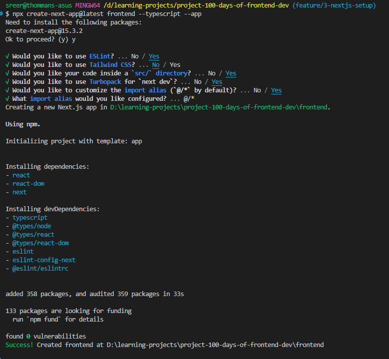

## Step 1: Create a Next.js Project

```bash
npx create-next-app@latest design-system-sandbox --typescript --app
```



### What is Turbopack?

Turbopack is Vercel's new development bundler. It replaces Webpack and is significantly faster during development. It supports Tailwind, TypeScript, and React. Choosing "Yes" is fully compatible with the rest of your setup.

### Step 2: Install Tailwind Manually

Install @tailwindcss/postcss and its peer dependencies via npm.

```bash
npm install tailwindcss @tailwindcss/postcss postcss
```

### Step 3 : Configure PostCSS Plugins

Create a postcss.config.mjs file in the root of your project and add the @tailwindcss/postcss plugin to your PostCSS configuration.

```bash
/** @type {import('tailwindcss').Config} */
const config = {
  plugins: {
    "@tailwindcss/postcss": {},
  },
};

export default config;
```

### Step 4 : Import TailwindCSS

Add an `@import` to `./src/app/globals. css` that imports Tailwind CSS.

```bash
@import "tailwindcss";
```

### Step 5 : Start Build Process

```bash
npm run dev
```
