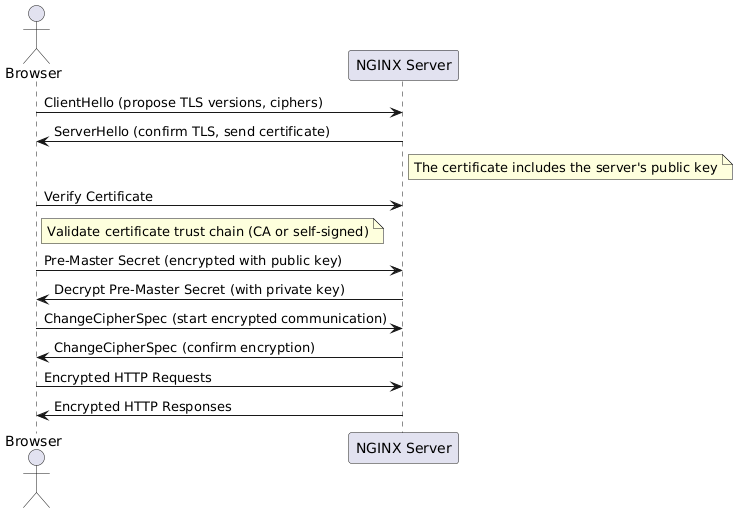

# NGINX Load Balancer with Node.js Apps - Tutorial (TechWorld with Nana)

This project sets up a simple load-balanced environment using Docker Compose. It includes three Node.js apps (`app1`, `app2`, `app3`) and an NGINX container that acts as a reverse proxy and load balancer.

---

## Project Structure

```

.
├── Dockerfile          # Node.js app container definition
├── docker-compose.yml  # Compose file to run NGINX and three app containers
├── nginx.conf          # NGINX load balancer and reverse proxy configuration
├── server.js           # Node.js server
├── index.html          # Basic static page for the apps
├── images/             # Static images (if any)
└── nginx-certs/        # SSL certificates for HTTPS (optional for dev)

```

---

## How It Works

- Three Node.js applications (`app1`, `app2`, `app3`) are built from the same `Dockerfile` and run on port 3000.
- NGINX acts as both a reverse proxy and load balancer.
- It listens on port 80 (HTTP) and port 443 (HTTPS), distributing incoming requests across the Node.js apps using a load-balancing strategy (`least_conn` for load balancing based on active connections).
- Requests to `http://localhost` or `https://localhost` are forwarded to one of the Node.js apps in the cluster.

---

## Usage

1. Build and start the services:

```bash
docker-compose up --build
```

2. Access the load balancer:

- HTTP: `http://localhost`
- HTTPS (self-signed, local dev only): `https://localhost`

You should see responses from different Node.js apps, verifying that NGINX is load balancing traffic among them.

---

SSL


Load Balancer


## Key Configuration

### NGINX Configuration (`nginx.conf`)

```nginx
worker_processes 1;

events {
    worker_connections 1024;
}

http {
    include mime.types;

    upstream nodejs_cluster {
        least_conn;
        server app1:3000;
        server app2:3000;
        server app3:3000;
    }

    server {
        listen 443 ssl;
        server_name localhost;

        ssl_certificate /etc/nginx/certs/nginx-selfsigned.crt;
        ssl_certificate_key /etc/nginx/certs/nginx-selfsigned.key;

        location / {
            proxy_pass http://nodejs_cluster;
            proxy_set_header Host $host;
            proxy_set_header X-Real-IP $remote_addr;
        }
    }

    server {
        listen 80;
        server_name localhost;

        return 301 https://$host$request_uri;
    }
}
```

### Docker Compose (`docker-compose.yml`)

```yaml
version: "3"
services:
  app1:
    build: .
    environment:
      - APP_NAME=app1
    ports:
      - "3000"
    networks:
      - webnet

  app2:
    build: .
    environment:
      - APP_NAME=app2
    ports:
      - "3000"
    networks:
      - webnet

  app3:
    build: .
    environment:
      - APP_NAME=app3
    ports:
      - "3000"
    networks:
      - webnet

  nginx:
    image: nginx:latest
    ports:
      - "80:80"
      - "443:443"
    volumes:
      - ./nginx.conf:/etc/nginx/nginx.conf:ro
      - ./nginx-certs:/etc/nginx/certs:ro
    depends_on:
      - app1
      - app2
      - app3
    networks:
      - webnet

networks:
  webnet:
```

---

## Next Steps

- Add health checks to upstream servers for better reliability.
- Configure production-ready HTTPS certificates (e.g., with Let’s Encrypt).
- Customize NGINX logs for easier debugging and monitoring.
- Fine-tune load balancing (e.g., sticky sessions, IP hashing).

---

This setup provides a solid foundation for learning and using NGINX as a reverse proxy and load balancer for your Node.js apps.
